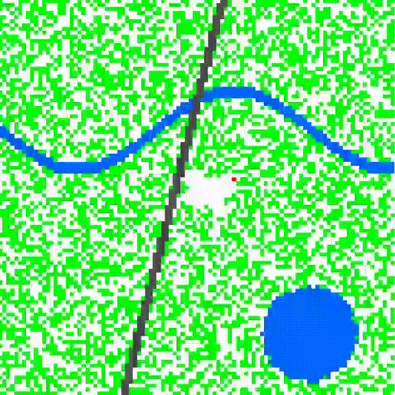

# 🔥 Simulador de Propagação de Incêndios (Autômatos Celulares)

> Simulação computacional que modela a propagação de fogo em florestas utilizando Autômatos Celulares e Lógica Probabilística.

## 📸 Demonstração

  

## 💻 Sobre o Projeto

Este projeto foi desenvolvido como parte de um estudo acadêmico na **Universidade Federal de Juiz de Fora (UFJF)**. O objetivo é simular a dinâmica de queimadas em florestas, permitindo analisar como barreiras naturais e artificiais influenciam a contenção do fogo.

A simulação utiliza uma matriz de estados (grid) onde cada célula representa uma área da floresta. O algoritmo atualiza o estado da floresta a cada iteração baseando-se nas células vizinhas e em probabilidades de propagação.

### 🛠 Funcionalidades e Diferenciais

* **Lógica de Permeabilidade:** Implementação de barreiras (como estradas e rios) que não bloqueiam o fogo totalmente, mas reduzem drasticamente a probabilidade de propagação, simulando o comportamento real de fagulhas.
* **Autômato Celular:** Uso de regras de transição de estados para simular sistemas complexos.
* **Visualização Gráfica:** Geração de mapas de calor (heatmaps) para visualizar a frente de fogo em tempo real.

## 🚀 Tecnologias Utilizadas

* **Python:** Linguagem principal.
* **NumPy:** Para manipulação de matrizes de alta performance e lógica matemática.
* **Matplotlib:** Para renderização gráfica da simulação.
* **Google Colab:** Ambiente de desenvolvimento e execução.

## 📂 Como Executar

Este projeto foi otimizado para rodar diretamente na nuvem via **Google Colab**, sem necessidade de instalar nada no seu computador.

1.  **Clique no botão abaixo** para abrir o notebook diretamente no Google Colab:
    
2.  Com o notebook aberto, vá no menu superior em **Ambiente de Execução (Runtime)** > **Executar tudo (Run all)**.
3.  Role a página para baixo para ver os gráficos e animações sendo gerados em tempo real.

## 👨‍💻 Autor

**João Victor Soares Monteiro**

---
*Desenvolvido no curso de Engenharia Computacional da UFJF.*
